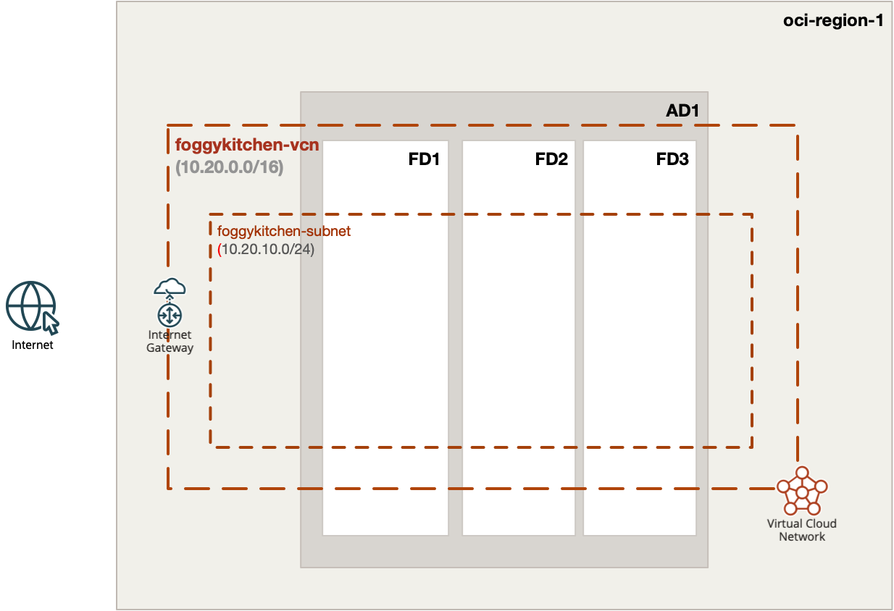
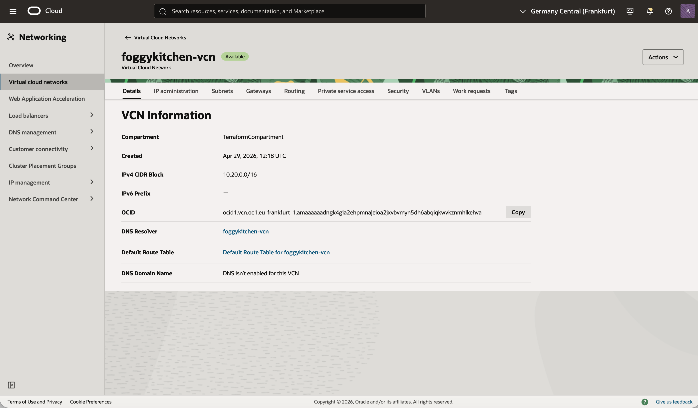
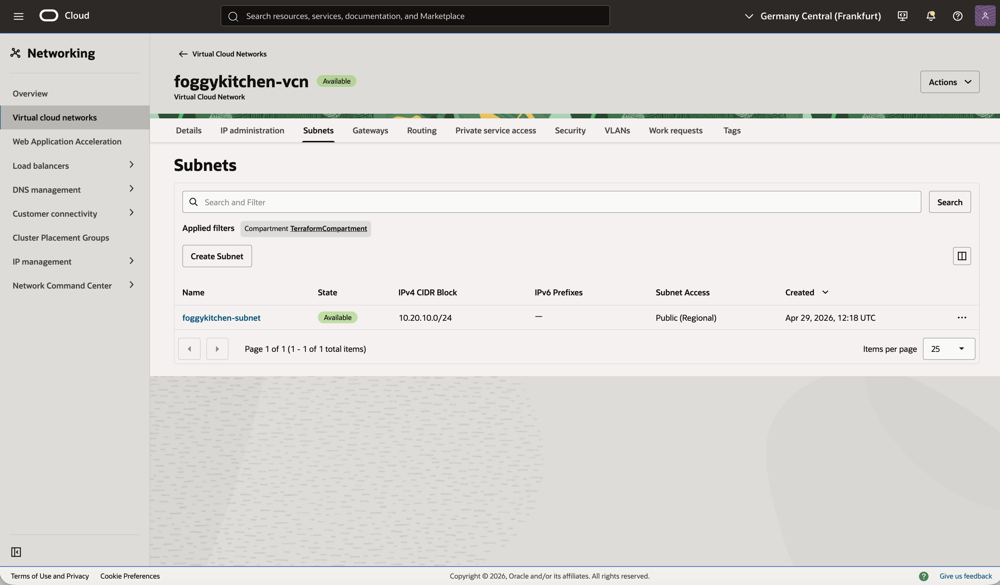
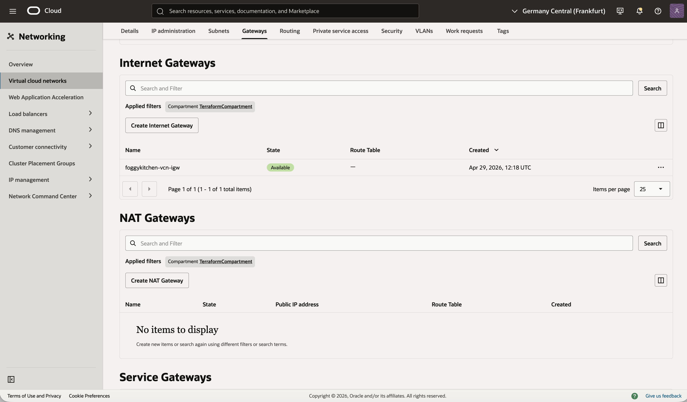

# Example 01: Basic OCI VCN

In this first example, we deploy a **minimal Oracle Cloud Infrastructure (OCI) Virtual Cloud Network (VCN)** using **Terraform/OpenTofu**.
All core networking resources are created from scratch: **VCN, Internet Gateway, Route Table, and a single public Subnet**.
This makes it a good starting point for anyone learning OCI networking or Infrastructure as Code.

This example is intentionally simple and focuses only on the **networking foundation**,
without compute instances, load balancers, NAT Gateway, or Service Gateway.

---

## 🧭 Architecture Overview



This deployment creates:
- A new **VCN** named `foggykitchen-vcn`.
- A single **public subnet** named `foggykitchen-subnet`.
- One **Internet Gateway** attached to the VCN.
- One **public route table** with a default route to the Internet Gateway.

There are no Security Lists customizations, NAT Gateway, Service Gateway, or private subnets in this example.
The goal is to understand the **absolute basics of OCI VCN provisioning**.

---

## 🚀 Deployment Steps

Initialize and apply the Terraform/OpenTofu configuration:

```bash
tofu init
tofu plan
tofu apply
```

After a successful deployment, Terraform will output:
- The VCN ID
- The Subnet IDs map

These outputs can be used in later examples as networking building blocks.

---

## 🖼️ OCI Console View

Below you can see the resulting VCN, subnet, and route table
as displayed in the OCI Console:







After deployment, you should see:
- A single VCN with CIDR block `10.20.0.0/16`
- One public subnet with CIDR block `10.20.10.0/24`
- One route table with `0.0.0.0/0` routed through the Internet Gateway

This is a minimal OCI network layout with public connectivity.

---

## 🧹 Cleanup

To remove all resources created by this example:

```bash
tofu destroy
```

---

## ✅ Summary

This example demonstrates:
- How to create a **basic OCI VCN** using Terraform/OpenTofu
- How VCN and subnet CIDR blocks are defined in OCI
- How to expose a subnet to the internet using an **Internet Gateway** and **Route Table**
- The foundation upon which more advanced scenarios can be built

---

## 🌐 Learn More

Visit [FoggyKitchen.com](https://foggykitchen.com/) for OCI, multicloud, and Terraform/OpenTofu learning resources.

---

## 🪪 License

Licensed under the **Universal Permissive License (UPL), Version 1.0**.  
See [LICENSE](../../LICENSE) for more details.

---

© 2026 [FoggyKitchen.com](https://foggykitchen.com) - Cloud. Code. Clarity.
